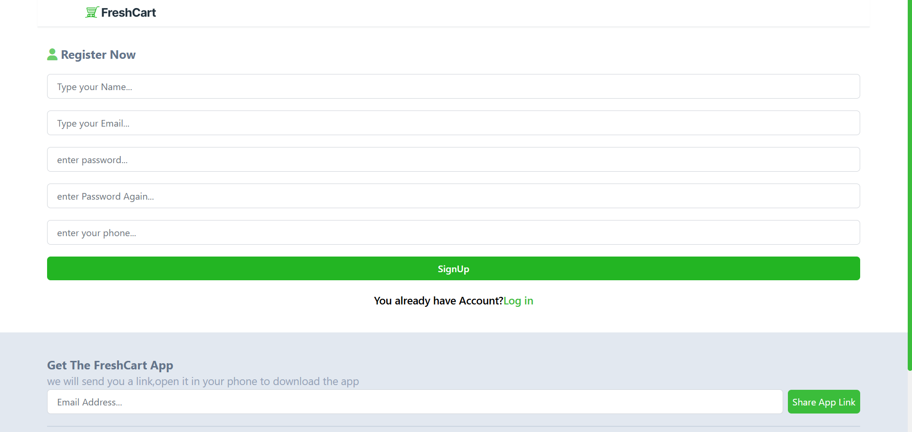
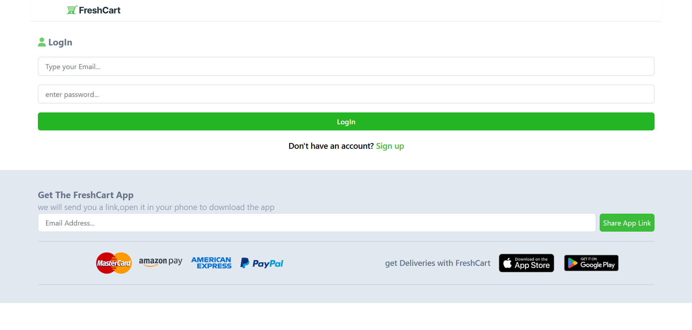
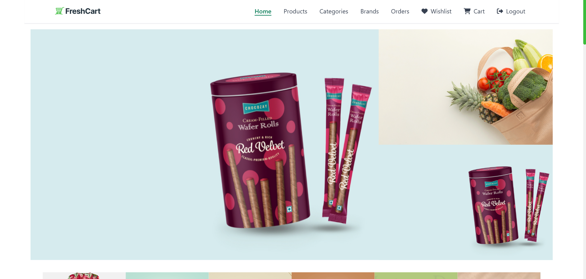
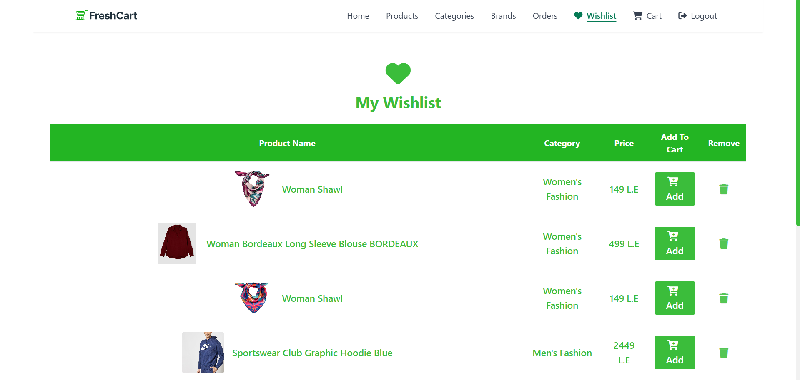
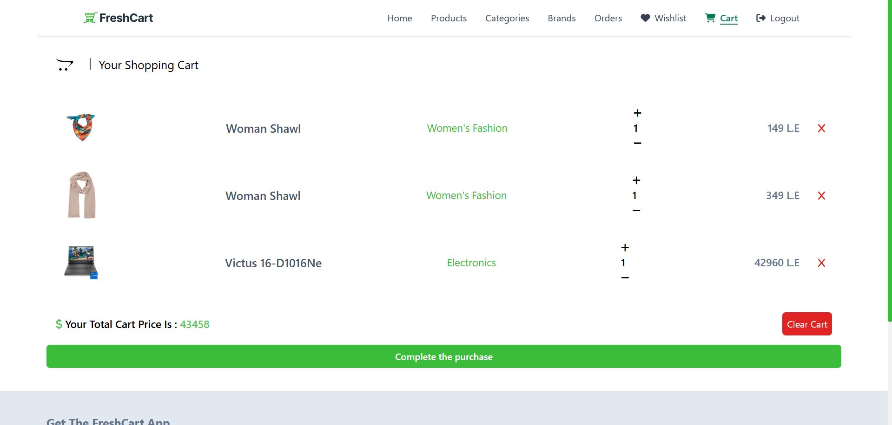

# 🛒 E-Commerce React App

Welcome to my **E-Commerce project**, a full-featured shopping platform built using **React**, **React Router**, **Context API**, and **Tailwind CSS**.  
This project showcases modern frontend development practices and is designed to simulate a real-world online shopping experience.

## 🔧 Features

- 🔐 User authentication (Sign up / Login)
- 🛍️ Browse products and categories
- 🛒 Add/remove items to/from cart
- ❤️ Wishlist support
- 📦 View and track orders
- 💳 Secure online payments integration
- 📱 Responsive design for mobile and desktop

## 📚 Technologies Used

- React
- React Router DOM
- Context API
- Axios
- Tailwind CSS
- JWT Decode
- Formik & Yup (for form handling & validation)
- Toastify (for alerts)

## 📷 Screenshots

